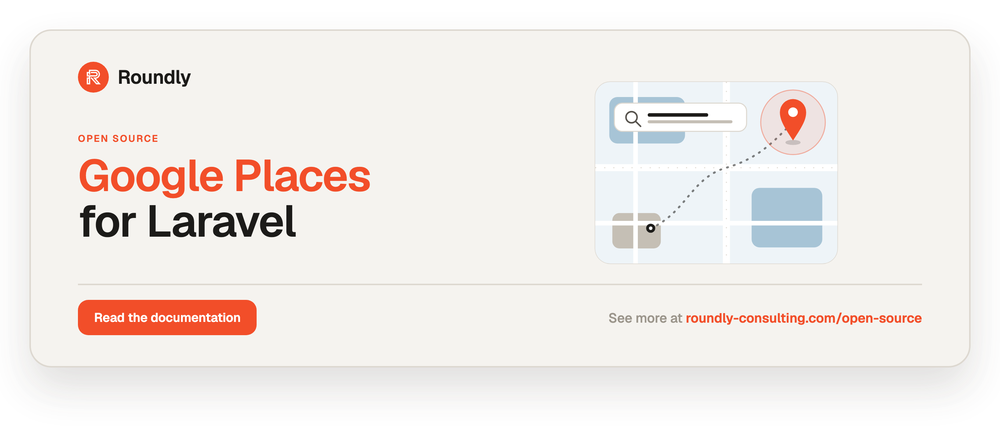

<!-- roundly-hero:start -->
<p align="center">
  <a href="https://roundly-consulting.com/open-source/docs/google-places-for-laravel?utm_source=github&utm_medium=readme&utm_campaign=open-source&utm_content=google-places-for-laravel">
    
  </a>
</p>
<!-- roundly-hero:end -->

# Google Places for Laravel

Query Google's **Places API (New)**, **Routes API**, and **Geocoding API** — place details,
autocomplete, text & nearby search, find place, reverse geocoding, distance/ETA, and photo
URLs — from Laravel through a small, fully typed client with expressive query objects and data
transfer objects.

Built entirely on Laravel's own HTTP client, with header authentication
(`X-Goog-Api-Key`), required field masks, configurable timeouts/retries, optional response
caching, lifecycle events, and a first-class `GooglePlaces::fake()` testing helper. No
third-party runtime dependencies.

## Requirements

- PHP `^8.4`
- Laravel `^12.0` or `^13.0`
- A Google Maps Platform API key with the **Places API (New)**, **Routes API**, and
  **Geocoding API** enabled

## Installation

```bash
composer require roundly-consulting/google-places-for-laravel
```

Optionally publish the config file:

```bash
php artisan vendor:publish --tag="google-places-config"
```

## Configuration

Set your key in `.env`:

```dotenv
GOOGLE_PLACES_API_KEY=your-google-maps-api-key
```

The package works with zero extra configuration once the key is set. Every value lives in
`config/google-places.php`:

| Key | Type | Default | Env | Purpose |
|---|---|---|---|---|
| `key` | `string` | `null` | `GOOGLE_PLACES_API_KEY` | API key. Sent as `X-Goog-Api-Key` (Places/Routes) and `key=` (Geocoding). Required. |
| `hosts.places` | `string` | `https://places.googleapis.com/v1` | `GOOGLE_PLACES_HOST` | Places API (New) host. |
| `hosts.routes` | `string` | `https://routes.googleapis.com` | `GOOGLE_ROUTES_HOST` | Routes API host (distance/ETA). |
| `hosts.geocoding` | `string` | `https://maps.googleapis.com/maps/api` | `GOOGLE_GEOCODING_HOST` | Geocoding API host (reverse geocoding). |
| `field_masks.details` | `string` | see config | — | `X-Goog-FieldMask` for place details. |
| `field_masks.autocomplete` | `string` | see config | — | `X-Goog-FieldMask` for autocomplete. |
| `field_masks.search` | `string` | see config | — | `X-Goog-FieldMask` for text/nearby search. |
| `field_masks.routes` | `string` | see config | — | `X-Goog-FieldMask` for the route matrix. |
| `http.timeout` | `int` | `10` | `GOOGLE_PLACES_TIMEOUT` | Request timeout (seconds). |
| `http.connect_timeout` | `int` | `5` | `GOOGLE_PLACES_CONNECT_TIMEOUT` | Connection timeout (seconds). |
| `http.retries` | `int` | `2` | `GOOGLE_PLACES_RETRIES` | Retries on connection failure. |
| `http.retry_delay` | `int` | `200` | `GOOGLE_PLACES_RETRY_DELAY` | Delay between retries (ms). |
| `cache.enabled` | `bool` | `false` | `GOOGLE_PLACES_CACHE` | Cache idempotent lookups (details/geocode/distance/search/matrix). |
| `cache.store` | `?string` | `null` | `GOOGLE_PLACES_CACHE_STORE` | Cache store (null = default). |
| `cache.ttl` | `int` | `86400` | `GOOGLE_PLACES_CACHE_TTL` | Cache TTL (seconds). |
| `pagination.max_pages` | `int` | `5` | `GOOGLE_PLACES_MAX_PAGES` | Safety cap for the paginated search helpers; a warning is logged when hit. |
| `logging.enabled` | `bool` | `false` | `GOOGLE_PLACES_LOGGING` | Log every call (endpoint, status, duration). The API key is never logged. |
| `logging.channel` | `?string` | `null` | `GOOGLE_PLACES_LOG_CHANNEL` | Log channel to write to (null = default channel). |

> **Field masks:** the Places API (New) and Routes API require an `X-Goog-FieldMask` header
> naming the fields to return. The defaults are conservative; trim them in config so you pay
> only for the fields you use.
>
> **Reverse geocoding** intentionally uses the Geocoding API (authenticated with the `key`
> query parameter), which is the current product for that capability.

## Usage

Resolve the client from the container (`PlacesClient` contract) or use the `GooglePlaces`
facade. Both point at the same singleton.

```php
use RoundlyConsulting\GooglePlaces\Contracts\PlacesClient;
use RoundlyConsulting\GooglePlaces\Facades\GooglePlaces;

$places = app(PlacesClient::class); // or use the GooglePlaces facade
```

Common lookups take a scalar shorthand or a full query object for options.

### Autocomplete

```php
use RoundlyConsulting\GooglePlaces\DataTransferObjects\AutocompletePrediction;
use RoundlyConsulting\GooglePlaces\DataTransferObjects\AutocompleteQuery;
use RoundlyConsulting\GooglePlaces\DataTransferObjects\Location;
use RoundlyConsulting\GooglePlaces\DataTransferObjects\LocationDefinition;
use RoundlyConsulting\GooglePlaces\Facades\GooglePlaces;

// String shorthand:
$predictions = GooglePlaces::autocomplete('Luxury Restaurant');

/** @var AutocompletePrediction $prediction */
$prediction = $predictions->first();

echo $prediction->description;
echo $prediction->placeId;
echo $prediction->mainText;       // structured label (nullable)
echo $prediction->secondaryText;  // structured label (nullable)
echo implode(', ', $prediction->types);

// Full query (immutable, fluent):
$query = (new AutocompleteQuery('Coffee'))
    ->ofType('cafe', 'restaurant')               // max 5 included primary types
    ->preferInArea((new LocationDefinition())->circle(new Location(48.1486, 17.1077), radius: 2000))
    ->inRegions('sk')                            // included region codes
    ->fromOrigin(new Location(48.1486, 17.1077))
    ->usingSessionToken('a-session-token');

$predictions = GooglePlaces::autocomplete($query);
```

#### Billing sessions

Tie an autocomplete burst plus the final `details()` call into one Google billing
session. The session reuses a single token automatically and is consumed once
`details()` resolves (calling it again throws a `PlacesException`).

```php
$session = GooglePlaces::session();

$session->autocomplete('piz');
$session->autocomplete('pizza ne');   // same session token
$place = $session->details($placeId); // billed as one session, then closed
```

### Place details

`details()` returns a `Place`, or `null` when the place is not found.

```php
use RoundlyConsulting\GooglePlaces\DataTransferObjects\DetailsQuery;
use RoundlyConsulting\GooglePlaces\DataTransferObjects\Place;
use RoundlyConsulting\GooglePlaces\Facades\GooglePlaces;

$place = GooglePlaces::details($prediction->placeId); // or new DetailsQuery(...)

if ($place instanceof Place) {
    echo $place->name;
    echo $place->id;
    echo $place->formattedAddress;
    echo implode(', ', $place->types);

    echo $place->geometry?->location->latitude;
    echo $place->geometry?->location->longitude;

    foreach ($place->openingHours?->periods ?? [] as $period) {
        // from/to are "HHMM" strings; integer accessors are also available.
        echo "{$period->day}: {$period->from}–{$period->to}";
        echo "{$period->openHour}:{$period->openMinute}";
    }

    // Photo resource names — pass to photoUrl().
    foreach ($place->photos as $photoName) {
        $url = GooglePlaces::photoUrl($photoName, maxWidth: 800, maxHeight: 600);
    }

    $raw = $place->raw; // untouched Google payload
}
```

Override the field mask per request by passing field names to `DetailsQuery`:

```php
new DetailsQuery($placeId, fields: ['id', 'displayName', 'location', 'types', 'photos']);
```

### Text & nearby search, find place

```php
use RoundlyConsulting\GooglePlaces\DataTransferObjects\Location;
use RoundlyConsulting\GooglePlaces\DataTransferObjects\NearbySearchQuery;
use RoundlyConsulting\GooglePlaces\DataTransferObjects\TextSearchQuery;
use RoundlyConsulting\GooglePlaces\Facades\GooglePlaces;

// Text search → Collection<Place>
$places = GooglePlaces::textSearch('pizza in Bratislava');

$places = GooglePlaces::textSearch(
    (new TextSearchQuery('vegan brunch'))->openNow()->withMinRating(4.0)->take(10),
);

// Nearby search → Collection<Place> (radius required, 0–50000 m)
$places = GooglePlaces::nearbySearch(
    (new NearbySearchQuery(new Location(48.1486, 17.1077), radius: 1500))
        ->withinTypes('cafe')
        ->rankBy('DISTANCE'),
);

// Find a single best match → ?Place
$place = GooglePlaces::findPlace('Eiffel Tower');
```

Text search caps at 60 results; pass a page token to walk a single page manually:

```php
$next = GooglePlaces::textSearch((new TextSearchQuery('pizza'))->withPageToken($token));
```

#### Auto-pagination

Let the package follow `nextPageToken` for you. `all()` eagerly collects every page;
`cursor()` returns a `LazyCollection` that fetches pages on demand. Both honour the
`pagination.max_pages` safety cap (a warning is logged when it's hit).

```php
// Eagerly collect every page into one collection:
$all = GooglePlaces::textSearchPaginated('museums in Bratislava')->all();

// Stream lazily — only fetches the next page when you ask for more places:
GooglePlaces::textSearchPaginated('museums')
    ->cursor()
    ->each(fn ($place) => /* ... */);

// Nearby search returns a single page (the New API does not paginate it):
$all = GooglePlaces::nearbySearchPaginated($nearbyQuery)->all();
```

#### Location-bias helpers

Bias or restrict text search and autocomplete fluently:

```php
use RoundlyConsulting\GooglePlaces\DataTransferObjects\Location;
use RoundlyConsulting\GooglePlaces\DataTransferObjects\TextSearchQuery;

(new TextSearchQuery('coffee'))->nearby(48.1486, 17.1077, radius: 2000);              // circle bias
(new TextSearchQuery('coffee'))->withinBounds(new Location(48.1, 17.0), new Location(48.2, 17.2)); // rectangle restriction
```

#### Place helpers

The `Place` DTO ships convenience accessors:

```php
$place->isOpenNow();           // bool
$place->coordinates();         // ?Location
$place->primaryType();         // ?string
$place->openingHoursFor(1);    // list<OpeningHourPeriod> for Monday (0 = Sunday)
```

### Reverse geocoding

`geocode()` returns a collection of `ReverseGeocodingResult` for a coordinate.

```php
use RoundlyConsulting\GooglePlaces\DataTransferObjects\Location;
use RoundlyConsulting\GooglePlaces\Facades\GooglePlaces;

$results = GooglePlaces::geocode(48.1486, 17.1077);   // lat/lng shorthand
// or GooglePlaces::geocode(new Location(48.1486, 17.1077));
// or GooglePlaces::geocode(new ReverseGeocodingQuery(...));

$result = $results->first();

echo $result->address;
echo $result->placeId;

foreach ($result->components as $component) {
    echo "{$component->longName} ({$component->shortName})";
}
```

### Forward geocoding (address → coordinates)

`geocodeAddress()` turns an address string into a collection of results (each with
coordinates, place id, types, and components).

```php
use RoundlyConsulting\GooglePlaces\DataTransferObjects\GeocodingQuery;
use RoundlyConsulting\GooglePlaces\Facades\GooglePlaces;

$results = GooglePlaces::geocodeAddress('1600 Amphitheatre Pkwy');

$first = $results->first();
echo $first->placeId;
echo $first->geometry->location->latitude;

// Full query with region + component filters:
$results = GooglePlaces::geocodeAddress(
    (new GeocodingQuery('Parliament'))->inRegion('sk')->filterBy('country:SK'),
);
```

### Typed address components

Both geocoding and place results expose ergonomic, typed accessors over their raw
address components via `components()`:

```php
$components = GooglePlaces::geocodeAddress('1600 Amphitheatre Pkwy')->first()->components();

echo $components->streetNumber(); // "1600"
echo $components->street();       // "Amphitheatre Parkway"
echo $components->city();         // "Mountain View"
echo $components->state();        // "California"
echo $components->postalCode();   // "94043"
echo $components->country();      // "United States"
echo $components->countryCode();  // "US"
```

On a `Place`, `components()` is populated only when `addressComponents` is included in
the field mask.

### Distance & travel time (Routes API)

`distance()` returns a `Distance` for a single destination, or a `Roundtrip` (legs plus
totals) when you pass `MultipleLocations`. Choose the mode with the `TravelMode` enum.

```php
use RoundlyConsulting\GooglePlaces\DataTransferObjects\DistanceQuery;
use RoundlyConsulting\GooglePlaces\DataTransferObjects\Location;
use RoundlyConsulting\GooglePlaces\DataTransferObjects\MultipleLocations;
use RoundlyConsulting\GooglePlaces\DataTransferObjects\Roundtrip;
use RoundlyConsulting\GooglePlaces\Enums\TravelMode;
use RoundlyConsulting\GooglePlaces\Facades\GooglePlaces;

$distance = GooglePlaces::distance(new DistanceQuery(
    from: new Location(48.1486, 17.1077),
    to: new MultipleLocations([
        new Location(48.2082, 16.3738),
        new Location(50.0755, 14.4378),
    ]),
    type: TravelMode::Driving,            // Driving | Walking | Bicycling | Transit
    departureAt: now()->addHour(),        // optional; enables traffic-aware driving ETAs
));

echo $distance->humanReadableDistance; // e.g. "330.4 km" (formatted by the package)
echo $distance->distanceInMeters;      // e.g. 330400
echo $distance->humanReadableDuration; // e.g. "3h 20m"
echo $distance->durationInSeconds;     // e.g. 12000
echo $distance->type->value;           // "driving"

if ($distance instanceof Roundtrip) {
    foreach ($distance->distances as $leg) {
        echo $leg->humanReadableDistance;
    }
}
```

> A leg with no available route raises a `PlacesException`. The Routes API does not return
> human-readable strings, so `humanReadableDistance`/`humanReadableDuration` are formatted by
> the package.

### Full distance matrix (M×N)

For many origins against many destinations, use `matrix()`. The travel-mode method runs
the request and returns a `DistanceMatrix` you can index by pair.

```php
use RoundlyConsulting\GooglePlaces\DataTransferObjects\Location;
use RoundlyConsulting\GooglePlaces\Facades\GooglePlaces;

$matrix = GooglePlaces::matrix(
    origins: [new Location(48.1486, 17.1077), new Location(48.2082, 16.3738)],
    destinations: [new Location(50.0755, 14.4378), new Location(47.4979, 19.0402)],
)->driving();                       // ->driving() / ->walking() / ->bicycling() / ->transit()

$element = $matrix->for(0, 1);      // origin 0 → destination 1
if ($element?->hasRoute()) {
    echo $element->distance->humanReadableDistance;
    echo $element->distance->durationInSeconds;
}

$matrix->origin(0);                 // Collection<MatrixElement> keyed by destination index
$matrix->destination(1);           // Collection<MatrixElement> keyed by origin index

// Traffic-aware driving ETAs:
GooglePlaces::matrix($origins, $destinations)->departingAt(now()->addHour())->driving();
```

### Photo URLs

```php
use RoundlyConsulting\GooglePlaces\Facades\GooglePlaces;

// $photoName is a photo resource name from a place ($place->photos).
$url = GooglePlaces::photoUrl($photoName, maxWidth: 800, maxHeight: 600);
```

### Fetching photo bytes

Beyond building the URL, `photo()` fetches the actual image. The API key is sent as a
request header and never exposed to the browser — `url()` returns Google's key-free media
URL.

```php
use RoundlyConsulting\GooglePlaces\Facades\GooglePlaces;

$photo = GooglePlaces::photo($photoName, maxWidth: 800, maxHeight: 600);

$bytes = $photo->contents();              // raw image bytes
$path  = $photo->save('public', 'p.jpg'); // store on a filesystem disk → returns the path
$url   = $photo->url();                   // final, key-free media URL (safe for the browser)
```

### Error handling

Failures throw `RoundlyConsulting\GooglePlaces\Exceptions\PlacesException`, with typed
accessors so you can branch on what went wrong. The API key is never included in messages,
events, or cache keys.

```php
use RoundlyConsulting\GooglePlaces\Exceptions\PlacesException;
use RoundlyConsulting\GooglePlaces\Facades\GooglePlaces;

try {
    $predictions = GooglePlaces::autocomplete('Coffee');
} catch (PlacesException $e) {
    if ($e->isRateLimited())      { /* back off */ }
    elseif ($e->isDenied())       { /* check key / billing / enabled APIs */ }
    elseif ($e->isInvalidRequest()) { /* fix the request */ }

    report($e); // $e->googleStatus(), $e->googleErrorMessage()
}
```

A missing API key throws `PlacesException::missingApiKey()` before any HTTP request is made.

### Events

Every call dispatches a lifecycle event you can listen to for logging, metrics, or alerting.
Neither event carries the API key.

```php
use RoundlyConsulting\GooglePlaces\Events\PlacesRequestFailed;
use RoundlyConsulting\GooglePlaces\Events\PlacesResponseReceived;

// PlacesResponseReceived: endpoint, httpStatus, googleStatus, durationMs
// PlacesRequestFailed:    endpoint, httpStatus, googleStatus, message
```

### Caching

Set `GOOGLE_PLACES_CACHE=true` to cache idempotent lookups (details, geocode, forward
geocode, distance, distance matrix, text & nearby search). Autocomplete is never cached.
Cache keys never contain the API key.

### Request logging

Opt-in logging of every call is built on the lifecycle events. The API key is never logged.

```dotenv
GOOGLE_PLACES_LOGGING=true
GOOGLE_PLACES_LOG_CHANNEL=stack   # optional; defaults to the app's default channel
```

### Validation rules

Validate place ids and coordinates in your own requests:

```php
use RoundlyConsulting\GooglePlaces\Rules\ValidCoordinates;
use RoundlyConsulting\GooglePlaces\Rules\ValidPlaceId;

$request->validate([
    'place' => ['required', new ValidPlaceId],
    'point' => ['required', new ValidCoordinates], // Location, [lat, lng], or "lat,lng"
]);
```

### Preflight check command

Verify the configured key and that each API is enabled/reachable (the key is redacted in
the output):

```bash
php artisan google-places:check
```

## Testing

Swap the live client for a fake — no `Http::fake()`, no live (paid) calls:

```php
use RoundlyConsulting\GooglePlaces\DataTransferObjects\AutocompletePrediction;
use RoundlyConsulting\GooglePlaces\DataTransferObjects\AutocompleteQuery;
use RoundlyConsulting\GooglePlaces\DataTransferObjects\Place;
use RoundlyConsulting\GooglePlaces\Facades\GooglePlaces;

$fake = GooglePlaces::fake();

$fake->withAutocomplete([new AutocompletePrediction('Café Roma', 'p1', ['cafe'])]);
$fake->withDetails(new Place('Café Roma'));

// ...exercise code that calls the facade...

$fake->assertAutocompleted(fn (AutocompleteQuery $q) => $q->input === 'Café');
$fake->assertDetailsRequested('p1');
$fake->assertNothingGeocoded();
```

Queue helpers: `withAutocomplete`, `withDetails`, `withGeocode`, `withGeocodeAddress`,
`withMatrix`, `withTextSearch`, `withNearbySearch`, `withFindPlace`, `withDistance`,
`withPhotoUrl`. Assertions: `assertAutocompleted`, `assertDetailsRequested`,
`assertGeocoded`, `assertAddressGeocoded`, `assertMatrixComputed`, `assertTextSearched`,
`assertNearbySearched`, `assertFindPlaceRequested`, `assertDistanceRequested`,
`assertNothingRequested`, `assertNothingGeocoded`, `assertNothingAutocompleted`.

`GooglePlaces::fake()` also drives `session()`, `matrix()`, and the paginated search
helpers, so code paths that use them stay fully fakeable. `photo()` is exercised with
Laravel's `Http::fake()` / `Storage::fake()`.

Run the package test suite with:

```bash
composer test
```

## Changelog

Please see [CHANGELOG](CHANGELOG.md) for more information on what has changed recently.

## Security

If you discover a security vulnerability, please review
[our security policy](../../security/policy) on how to report it.

## Credits

- [Andrej Mihaliak](https://github.com/mihaliak)

## License

The MIT License (MIT). Please see [License File](LICENSE.md) for more information.
